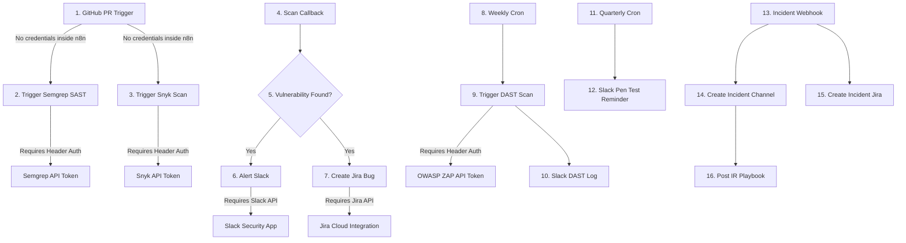

# Credential Setup Runbook for n8n Security Workflow

This runbook provides step-by-step instructions to configure every credential required by the nodes in the [n8n_security_workflow.json](file:///c:/Users/sivak/OneDrive/Desktop/security%20node/n8n_security_workflow.json) from the first node to the last node.

---

## 🗺️ Workflow Credentials Map

Here is the sequential order of nodes in the workflow and their credential requirements:

---

## 🔑 Detailed Credential Configuration Steps

### 1. GitHub PR Trigger (Node: `GitHub PR Webhook`)
* **Type:** Webhook (Incoming)
* **Credential Name in n8n:** None required inside n8n.
* **Setup Steps:**
  1. Once the workflow is active in n8n, copy the **Production URL** or **Test URL** from the double-clicked webhook node.
  2. Go to your **GitHub Repository** -> **Settings** -> **Webhooks** -> **Add webhook**.
  3. Paste the URL in **Payload URL**.
  4. Set **Content type** to `application/json`.
  5. Select **Let me select individual events** -> check **Pull requests**.
  6. Click **Add webhook**.

---

### 2. Semgrep SAST (Node: `Trigger Semgrep SAST`)
* **Type:** Header Auth (`httpHeaderAuth`)
* **Credential Name in n8n:** `Semgrep API Token`
* **Setup Steps:**
  1. Log in to your [Semgrep AppSec Platform](https://semgrep.dev).
  2. Navigate to **Settings** -> **Tokens** -> **Create Token**.
  3. Copy the generated token (looks like a long string of letters and numbers).
  4. In your n8n workspace:
     - Go to **Credentials** -> **Add Credential** -> Search and select **Header Auth**.
     - Name the credential: `Semgrep API Token`.
     - Set **Name**: `Authorization`
     - Set **Value**: `Bearer <YOUR-SEMGREP-APPSEC-TOKEN>` (replace `<YOUR-SEMGREP-APPSEC-TOKEN>` with the copied token).
     - Save the credential.

---

### 3. Snyk Dependency Scan (Node: `Trigger Snyk Dependency Scan`)
* **Type:** Header Auth (`httpHeaderAuth`)
* **Credential Name in n8n:** `Snyk API Token`
* **Setup Steps:**
  1. Log in to your [Snyk Dashboard](https://app.snyk.io).
  2. Click on your profile avatar in the bottom-left corner -> **Account Settings**.
  3. Locate the **API Token** section, click **Show**, and copy the token.
  4. In your n8n workspace:
     - Go to **Credentials** -> **Add Credential** -> Search and select **Header Auth**.
     - Name the credential: `Snyk API Token`.
     - Set **Name**: `Authorization`
     - Set **Value**: `token <YOUR-SNYK-API-TOKEN>` (Note the word `token` followed by a space, then your API key).
     - Save the credential.

---

### 4. Slack Integrations (Nodes: `Alert Slack`, `Slack DAST Log`, `Slack Pen Test Reminder`, `Create Incident Channel`, `Post IR Playbook`)
* **Type:** Slack API (`slackApi`)
* **Credential Name in n8n:** `Slack Security App`
* **Setup Steps:**
  1. Go to [api.slack.com/apps](https://api.slack.com/apps) and click **Create New App** -> Select **From scratch**.
  2. Name your app (e.g., `n8n Security Bot`) and choose your Slack workspace.
  3. Under **Features**, select **OAuth & Permissions**.
  4. Scroll down to **Scopes** -> **Bot Token Scopes** and add the following permissions:
     - `channels:manage` (allows creating incident rooms)
     - `chat:write` (allows posting messages and playbooks)
     - `groups:write` (allows managing private channels if needed)
     - `channels:read` & `groups:read` (to search/list channels)
  5. Scroll up and click **Install to Workspace** -> **Allow**.
  6. Copy the **Bot User OAuth Token** (starts with `xoxb-`).
  7. In your n8n workspace:
     - Go to **Credentials** -> **Add Credential** -> Search and select **Slack API**.
     - Set **Authentication** to `Access Token`.
     - Paste your `xoxb-` token in the **Access Token** field.
     - Save the credential.
  8. **Crucial:** In Slack, invite your new bot to the `#security-alerts` channel by typing `/invite @<Your Bot Name>` in that channel.

---

### 5. Jira Bug & Incident Creation (Nodes: `Create Jira Bug`, `Create Incident Jira`)
* **Type:** Jira Software Server API (`jiraSoftwareServerApi`)
* **Credential Name in n8n:** `Jira Cloud Integration`
* **Setup Steps:**
  1. Log in to your Jira Cloud/Atlassian account.
  2. Generate an API token at [id.atlassian.com/manage-profile/security/api-tokens](https://id.atlassian.com/manage-profile/security/api-tokens).
  3. Click **Create API Token**, name it `n8n Integration`, and copy the token.
  4. In your n8n workspace:
     - Go to **Credentials** -> **Add Credential** -> Search and select **Jira Software Server API**.
     - Set the configuration:
       - **Host**: `https://<your-domain>.atlassian.net` (replace with your actual Jira URL).
       - **Email**: Your Jira account login email.
       - **API Token**: Paste the Atlassian API token you just generated.
     - Save the credential.

---

### 6. OWASP ZAP DAST Scan (Node: `Trigger DAST Scan`)
* **Type:** Header Auth (`httpHeaderAuth`)
* **Credential Name in n8n:** `OWASP ZAP API Token`
* **Setup Steps:**
  1. Open your OWASP ZAP desktop client or daemon.
  2. Go to **Tools** -> **Options** -> **API**.
  3. Note down the **API Key** configured there (or generate a new one).
  4. In your n8n workspace:
     - Go to **Credentials** -> **Add Credential** -> Search and select **Header Auth**.
     - Name the credential: `OWASP ZAP API Token`.
     - Set **Name**: `X-ZAP-API-Key`
     - Set **Value**: `<YOUR-ZAP-API-KEY>` (paste the API Key).
     - Save the credential.

---

## 🚨 Verification & Testing

Once all credentials are saved, you can verify each credentials set by selecting the node in the n8n canvas and clicking **Test Step** or **Execute Node**.
